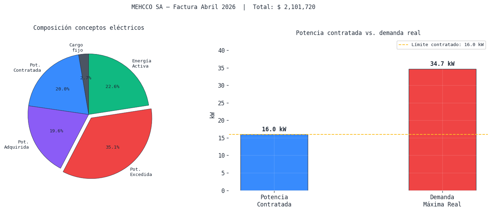
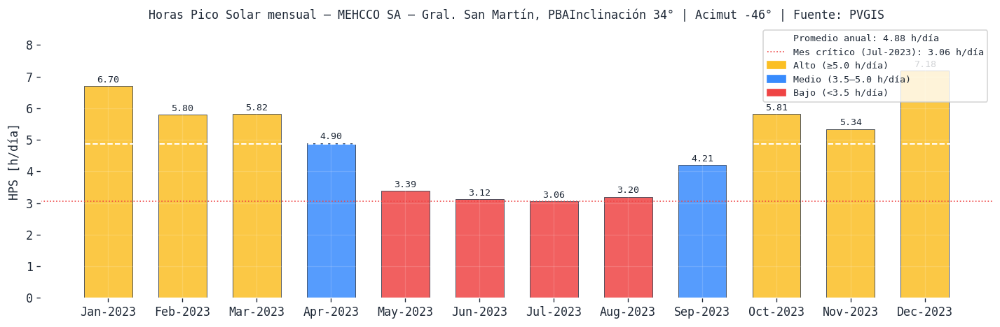
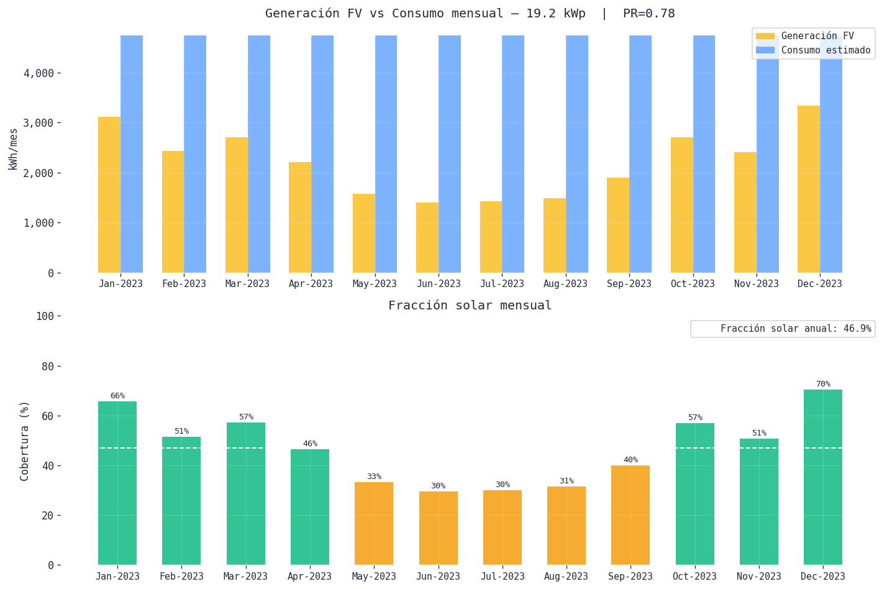

# Diseño de Sistema de Generación Fotovoltaica On-Grid

---

| | |
|---|---|
| **Cliente** | MEHCCO SA |
| **Suministro** | Tarifa T2 — EDENOR |
| **Ubicación** | Ricardo Güiraldes 4567, B1650MDE Villa Juan, Buenos Aires, Argentina |
| **Período de referencia** | 16/03/2026 al 15/04/2026 |
| **Fecha del informe** | 2026 |

---
Ricardo Güiraldes 4567, 

## 1. Datos del proyecto
### ⚙️ PARÁMETROS EDITABLES — Modificar acá para recalcular todo el informe

---

### 📋 Resumen de Parámetros del Proyecto

---

| 🌍 Ubicación y Suministro | Detalle |
| :--- | :--- |
| **Sitio** | MEHCCO SA — Gral. San Martín, PBA |
| **Coordenadas** | -34.5747566, -58.5564361 (Altitud: 20m) |
| **Distribuidor / Tarifa** | EDENOR — Tarifa T2 |
| **Potencia Contratada** | 16.0 kW |

 

| ⚙️ Equipamiento Seleccionado | Especificaciones |
| :--- | :--- |
| **Panel Solar** | Vertex TSM-NEG19RC.20 625W — **625 Wp** |
| **Inversor** | Fronius Symo 15.0-3-M — **15.0 kW AC** |
| **Performance Ratio (PR)** | 78% |

 

| 📐 Geometría del Techo | Medida |
| :--- | :--- |
| **Área Disponible** | 140 m² |
| **Inclinación (Tilt)** | 34° |
| **Acimut** | -46° |

---

---
## 2. Análisis del estado actual

### 2.1 Descripción del suministro

    ═══════════════════════════════════════════════════════
      COMPOSICIÓN DE LA FACTURA — CONCEPTOS ELÉCTRICOS
    ═══════════════════════════════════════════════════════
               Concepto Importe ($)  Participación (%)
             Cargo fijo    $ 40,691                2.7
    Potencia Contratada   $ 305,102               20.0
     Potencia Adquirida   $ 299,218               19.6
      Potencia Excedida   $ 534,311               35.1
         Energía Activa   $ 343,705               22.6
    ───────────────────────────────────────────────────────
      Total conceptos eléctricos : $ 1,523,027
      Impuestos y contribuciones : $ 569,993
      Tasa municipal             : $ 8,700
      TOTAL FACTURA              : $ 2,101,720
    ═══════════════════════════════════════════════════════
    
      ⚠  Potencia CONTRATADA : 16.0 kW
      ⚠  Potencia CONSUMIDA  : 34.68 kW
      ⚠  Potencia EXCEDIDA   : 18.68 kW
    
      Cargo por excedida representa el 35.1% del total eléctrico
    

### 2.2 Gráfico — Composición de la factura

    

    

### 2.3 Consumo histórico y costo efectivo del kWh

    Período      Energía (kWh)      Diario (kWh/día)     Potencia máx (kW)
    ─────────────────────────────────────────────────────────────────
    Ene-26       4,864              162.1                44.00
    Feb-26       5,291              176.4                49.00
    Mar-26       4,646              154.9                35.00
    Abr-26       4,173              139.1                34.68
    ─────────────────────────────────────────────────────────────────
    Promedio     4,744              158.1                40.67
    
      Consumo promedio mensual  : 4,744 kWh/mes
      Consumo diario promedio   : 158.1 kWh/día
      Precio efectivo del kWh   : $ 494 /kWh
      (incluye energía + potencia + impuestos + tasas)
    
      Perfil de carga supuesto  : 8:00 a 18:00 hs
      Días laborales            : Lunes a Viernes + Sábado hasta 13hs
      Consumo medio por hora    : 15.8 kWh/h (estimación uniforme)
      Demanda media en turno    : 15.8 kW (estimación)
    

---
## 3. Recurso solar del sitio

### 3.1 Posición geográfica y descarga de datos TMY desde PVGIS

    Sitio definido: MEHCCO SA — Gral. San Martín, PBA
      Lat: -34.5747566° | Lon: -58.5564361° | Alt: 20 m
    
    Descargando TMY desde PVGIS...
    ✓ TMY descargado: 8760 registros horarios (8760 h/año)
      Variables: ['temp_air', 'relative_humidity', 'ghi', 'dni', 'dhi', 'IR(h)', 'wind_speed', 'wind_direction', 'pressure']
    

### 3.2 Irradiancia sobre el plano del array (POA)

    HPS mensual para el sitio
    Inclinación: 34°  |  Acimut: -46°  |  PVGIS online
    
         Mes  H(i) kWh/m²  HPS (h/día)  T_amb media °C
    Jan-2023        207.6         6.70            24.7
    Feb-2023        162.4         5.80            22.4
    Mar-2023        180.4         5.82            21.2
    Apr-2023        147.0         4.90            18.2
    May-2023        105.2         3.39            13.8
    Jun-2023         93.6         3.12            11.4
    Jul-2023         94.8         3.06             9.9
    Aug-2023         99.2         3.20            10.6
    Sep-2023        126.2         4.21            14.7
    Oct-2023        180.1         5.81            16.8
    Nov-2023        160.2         5.34            19.8
    Dec-2023        222.6         7.18            21.8
    
      HPS promedio anual : 4.88 h/día
      HPS mínima (peor)  : 3.06 h/día  ← mes de diseño: Jul-2023
      HPS máxima (mejor) : 7.18 h/día
    

### 3.3 Gráfico — Recurso solar mensual

    

    

### 3.4 Verificación de condiciones extremas

      Parámetros del panel a distintas temperaturas:
      Parámetro      STC (25°C)    Frío (-5°C)   Calor (71°C)
      ────────────────────────────────────────────────────
      Voc [V]             49.90          53.49          44.39
      Vmpp [V]            41.70          44.70          37.10
      Isc [A]             15.92          15.73          16.21
      Pmpp [W]            625.0          679.4          541.6
    

---
## 4. Propuesta de potencia a instalar

### 4.1 Potencia FV propuesta y criterios

    Potencia FV necesaria según fracción solar objetivo
    (consumo diario diurno estimado: 134.4 kWh/día)
    
       FS objetivo   P_FV necesaria (kWp) Viabilidad
      ───────────────────────────────────────────────────────
              30%                10.6 kWp  ✓ (~17 paneles, ~65 m²)
              40%                14.1 kWp  ✓ (~23 paneles, ~88 m²)
              50%                17.7 kWp  ⚠ límite (~29 paneles, ~111 m²)
              60%                21.2 kWp  ⚠ límite (~34 paneles, ~130 m²)
              70%                24.7 kWp  ⚠ límite (~40 paneles, ~153 m²)
              80%                28.3 kWp  ⚠ límite (~46 paneles, ~176 m²)
    
      Restricciones:
        Potencia contratada (techo regulatorio fácil) : 16.0 kW
        Área disponible en techo                      : 140 m²
        Potencia AC del inversor seleccionado         : 15.0 kW
    

### 4.2 Potencia seleccionada y justificación

    Inversor seleccionado : Fronius Symo 15.0-3-M
      Potencia AC nominal : 15.0 kW
      Potencia DC máxima  : 22.5 kW
    
    Estimación de generación:
      E diaria estimada   : 57.1 kWh/día
      E anual estimada    : 20,818 kWh/año
      Consumo anual est.  : 56,922 kWh/año
      Fracción solar est. : 36.6%
    
      Nota: la fracción solar real depende del array definitivo
      que se calcula en la sección siguiente.
    

---
## 5. Selección del inversor y del panel — Análisis de datasheets

### 5.1 Inversor seleccionado

    INVERSOR SELECCIONADO: Fronius Symo 15.0-3-M
    ═══════════════════════════════════════════════════════
      Potencia AC nominal        : 15,000 W  (15.0 kW)
      Potencia DC máxima admis.  : 22,500 W  (22.5 kW)
      Tensión DC máxima absoluta : 1000 V  ← techo de seguridad
      Rango MPPT                 : 200 V — 800 V
      Corriente DC máx. por MPPT : 27.0 A
      Corriente cortocircuito DC : 33.0 A
      Número de entradas MPPT    : 2
      Eficiencia máxima          : 97.5%
      Eficiencia europea         : 97.1%
      Fases / Tensión AC         : 3F / 380 V
    ═══════════════════════════════════════════════════════
    
      Centro del rango MPPT      : 500 V  ← tensión objetivo del array
    

### 5.2 Panel seleccionado

    PANEL SELECCIONADO: Vertex TSM-NEG19RC.20 625W
    ═══════════════════════════════════════════════════════
      Potencia pico STC          : 625 Wp
      Voc STC                    : 49.90 V
      Vmpp STC                   : 41.70 V
      Isc STC                    : 15.92 A
      Impp STC                   : 15.00 A
      Coef. temp. Voc (β)        : -0.240 %/°C
      Coef. temp. Isc (α)        : 0.040 %/°C
      Coef. temp. Pmpp (γ)       : -0.290 %/°C
      NOCT                       : 43°C
      Dimensiones                : 2382 × 1234 mm
      Tensión máxima del sistema : 1500 V
    ═══════════════════════════════════════════════════════
      Área por panel             : 2.939 m²
      Eficiencia STC             : 21.3%
    

---
## 6. Cálculo del array — Strings en serie y en paralelo

### 6.1 Número de paneles en serie

El cálculo se realiza en tres condiciones de temperatura para garantizar operación segura
en todos los escenarios posibles:

$$N_{serie,max,abs} = \left\lfloor \frac{V_{dc,max}}{V_{oc}(T_{min})} \right\rfloor$$

$$N_{serie,max,MPPT} = \left\lfloor \frac{V_{MPPT,max}}{V_{mpp}(T_{min})} \right\rfloor$$

$$N_{serie,min} = \left\lceil \frac{V_{MPPT,min}}{V_{mpp}(T_{max})} \right\rceil$$

    CÁLCULO DE PANELES EN SERIE
    ════════════════════════════════════════════════════════════
    
      Condición 1 — T_min = -5.0°C (peor caso sobretensión)
        Voc(-5.0°C)    = 53.493 V/panel
        N_max_abs  = floor(1000 / 53.493) = 18 paneles
    
      Condición 2 — T_min = -5.0°C (límite MPPT superior)
        Vmpp(-5.0°C)   = 44.702 V/panel
        N_max_mppt = floor(800 / 44.702) = 17 paneles
    
      Condición 3 — T_max = 71.0°C (peor caso subtensión)
        Vmpp(71.0°C)   = 37.096 V/panel
        N_min_mppt = ceil(200 / 37.096) = 6 paneles
    
      ─────────────────────────────────────────────────────
      Límite superior definitivo : min(18, 17) = 17 paneles
      RANGO VÁLIDO               : 6 ≤ N_serie ≤ 17
    
      ✓ Rango válido — se puede diseñar el string
    

### 6.2 Elección del número de paneles en serie y verificación

    STRING ELEGIDO: 14 paneles en serie
    ════════════════════════════════════════════════════════════
    
      Tensiones del string:
        Vmpp a STC  (25°C)  : 583.8 V
        Vmpp a frío (-5.0°C) : 625.8 V
        Vmpp a calor (71.0°C): 519.3 V
        Voc  a frío (-5.0°C) : 748.9 V
    
      Verificaciones de seguridad:
        Voc(-5.0°C) = 748.9 V < V_dc_max = 1000 V  ✓ OK
        Vmpp(-5.0°C) = 625.8 V < V_mppt_max = 800 V  ✓ OK
        Vmpp(71.0°C)  = 519.3 V > V_mppt_min = 200 V  ✓ OK
        Vmpp_STC en el 64% del rango MPPT  ⚠ Considerar ajustar N_SERIE
    
      ✓ CONFIGURACIÓN VÁLIDA — 14 paneles en serie
    

### 6.3 Número de strings en paralelo

    CÁLCULO DE STRINGS EN PARALELO
    ════════════════════════════════════════════════════════════
    
      Límite por corriente MPPT  : floor(27.0 / 15.92) = 1 strings
      Límite por corriente Isc   : floor(33.0 / 15.92) = 2 strings
      Límite por MPPT disponibles: 2 entradas
    
      Strings en paralelo elegidos : 2
      Total paneles                : 14 × 2 = 28 paneles
      Potencia DC total            : 19,250.0 W  (19.25 kWp)
      Oversizing DC/AC             : 128.3%
      Evaluación                   : ✓ Óptimo para Buenos Aires
    
      P_dc_total (19,250.0 W) ≤ P_dc_max inversor (22,500 W)  ✓ OK
    

---
## 7. Verificación en condiciones extremas

### 7.1 Peor caso de sobrecorriente (IEC 62548)

$$I_{campo,max} = N_{paralelo} \times I_{sc,STC} \times 1{,}25$$

    VERIFICACIÓN DE CORRIENTES — PEOR CASO
    ════════════════════════════════════════════════════════════
    
      Corriente Impp del campo     : 30.00 A  (operación normal)
      Corriente Isc del campo      : 31.84 A  (cortocircuito STC)
      Corriente de diseño (×1,25)  : 39.80 A  ← base para conductores
    
      I_sc_campo (31.84A) ≤ I_sc_max inversor (33.0A)  ✓ OK
    

### 7.2 Resumen del diseño del array

### ☀️ Resumen del Diseño del Array

| Parámetro | Detalle |
| :--- | :--- |
| **Panel** | Vertex TSM-NEG19RC.20 625W |
| **Inversor** | Fronius Symo 15.0-3-M |
| **Configuración** | 14S × 2P = 28 paneles totales |
| **Potencia DC** | 19.25 kWp |
| **Potencia AC** | 15.0 kW AC |
| **Oversizing DC/AC** | 128.3% |

#### ⚡ Verificaciones Eléctricas
| Parámetro | Condición | Estado |
| :--- | :--- | :--- |
| **Voc a -5.0°C** | 748.9 V < 1000 V | ✓ OK |
| **Vmpp frío** | 625.8 V < 800 V | ✓ OK |
| **Vmpp calor** | 519.3 V > 200 V | ✓ OK |
| **Corriente Máx** | 39.80 A  | ✓ OK |

#### 📐 Verificación de Espacio
| Medida | Valor |
| :--- | :--- |
| Área neta de paneles | 82.3 m² |
| Área total (con sep.) | 107.0 m² |
| Área disponible | 140 m² |
| **Estado del techo** | 🟢 **Suficiente** |

---
## 8. Estimación de generación anual

### 8.1 Performance Ratio — desglose de pérdidas

$$PR = 1 - \sum L_i$$

    DESGLOSE DEL PERFORMANCE RATIO
    ═════════════════════════════════════════════
      Temperatura de paneles         : -7.0%
      Suciedad y polvo               : -3.0%
      Sombreado (estimado)           : -2.0%
      Mismatch entre paneles         : -1.0%
      Pérdidas en cableado DC        : -1.5%
      Pérdidas en cableado AC        : -0.8%
      Eficiencia del inversor        : -2.9%
      Disponibilidad sistema         : -1.0%
    ─────────────────────────────────────────────
      PR calculado              : 0.808  (80.8%)
      PR usado en cálculo       : 0.780  (78.0%)
    
      ✓ PR consistente con el desglose de pérdidas
    

### 8.2 Generación mensual y anual

    GENERACIÓN ESTIMADA MENSUAL
    Sistema: 14S×2P — 19.25 kWp DC — PR=0.78
    
      Mes       H(i) kWh/m²  HPS h/día   Gen. kWh   Consumo kWh  Cobertura
      ─────────────────────────────────────────────────────────────────
      Jan-2023        207.6       6.70      3,117         4,744      65.7%
      Feb-2023        162.4       5.80      2,438         4,744      51.4%
      Mar-2023        180.4       5.82      2,709         4,744      57.1%
      Apr-2023        147.0       4.90      2,207         4,744      46.5%
      May-2023        105.2       3.39      1,580         4,744      33.3%
      Jun-2023         93.6       3.12      1,405         4,744      29.6%
      Jul-2023         94.8       3.06      1,423         4,744      30.0%
      Aug-2023         99.2       3.20      1,489         4,744      31.4%
      Sep-2023        126.2       4.21      1,895         4,744      39.9%
      Oct-2023        180.1       5.81      2,704         4,744      57.0%
      Nov-2023        160.2       5.34      2,405         4,744      50.7%
      Dec-2023        222.6       7.18      3,342         4,744      70.4%
      ─────────────────────────────────────────────────────────────────
      TOTAL/AÑO         1779                26,714        56,928      46.9%
    
      Generación anual          : 26,714 kWh/año
      Producción específica     : 1388 kWh/kWp/año  (esperado: 1300–1600)
      Fracción solar anual      : 46.9%
    

### 8.3 Gráfico — Generación vs consumo mensual

    

    

    Generación anual total: 26,714 kWh/año
    Fracción solar anual  : 46.9%
    

---
## 9. Resumen ejecutivo del diseño

### 📊 Resumen Ejecutivo — Sistema FV On-Grid
**MEHCCO SA — T2 EDENOR**

| 📍 Sitio | Detalle |
| :--- | :--- |
| **Ubicación** | MEHCCO SA — Gral. San Martín, PBA |
| **Coordenadas** | -34.5747566°, -58.5564361° |
| **Inclinación / Acimut** | 34° | -46° |

 

| ⚙️ Equipos y Array | Especificaciones |
| :--- | :--- |
| **Panel** | Vertex TSM-NEG19RC.20 625W |
| **Inversor** | Fronius Symo 15.0-3-M |
| **Configuración** | 14 paneles serie × 2 strings paralelo = 28 paneles |
| **Potencia DC** | 19.25 kWp |
| **Potencia AC** | 15.0 kW (inversor) |
| **Oversizing** | 128.3% |

 

| ⚡ Generación Estimada | Valores |
| :--- | :--- |
| **Energía anual estimada** | 26,714 kWh/año |
| **Prod. específica** | 1388 kWh/kWp/año |
| **Fracción solar** | 46.9% |
| **Performance Ratio** | 0.78 (78%) |

 

| 🧾 Estado Actual de la Factura | Valores |
| :--- | :--- |
| **Consumo mensual promedio** | 4,744 kWh/mes |
| **Potencia contratada** | 16.0 kW |
| **Demanda máxima real** | 34.68 kW ⚠ *excede contrato* |
| **Total factura referencia** | $ 2,101,720 |
| **Precio efectivo kWh** | $ 494/kWh |

